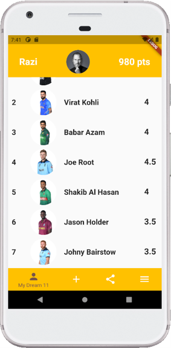

# Exercise 10 - Flutter and SQLite
This exercise is expected you to get yourself familiarized with SQLite in Flutter. These exercises assume you already have setup your environment for working with Flutter.

## Instructions
* You are required to setup the environment that you are planning to use this term for this course
* You need Flutter framework to be installed and configured on your local machine to work with these exercises
* This exercise is for your practice, no need to submit it for marking.

### Basic
In real world applications, you not necessarily always have to create a new database to work with. Sometimes, you have to work with existing databases as well. This exercise would requires you to work on an existing SQLite database. You'll do the following things: 
* Fetch an existing `.db` file and check to see if this database already exists in the application package.
* If the Database already exists, then that database will be used.
* If the Database does not exist, it will create a new database by copying from the provided databases.

Follow the instructions below to get the database and place it in `assets` folder of your `Cricket Fantasy League` app. If `assets` folder does not exist already, create it and place `my_sqlite.db` file in it. You can find `my_sqlite.db` file in this repo.  
Once the db file is placed, update your `pubspec.yaml` file to include that asset by adding the following lines:
```
  assets:
    - assets/my_sqlite.db
```
After completing the above step, update your _createDatabase method in DBHelper class with the following code:
```
Future<Database> _createDatabase() async {
    var databasesPath = await getDatabasesPath();
    var path = join(databasesPath, "my_sqlite.db");

// Check if the database exists
    var exists = await databaseExists(path);

    if (!exists) {
      // Should happen only the first time you launch your application
      print("Creating new copy from asset");

      // Make sure the parent directory exists
      try {
        await Directory(dirname(path)).create(recursive: true);
      } catch (_) {}

      // Copy from asset
      ByteData data = await rootBundle.load(join("assets", "my_sqlite.db"));
      List<int> bytes =
          data.buffer.asUint8List(data.offsetInBytes, data.lengthInBytes);

      // Write and flush the bytes written
      await File(path).writeAsBytes(bytes, flush: true);
    } else {
      print("Opening existing database");
    }
// open the database
    return await openDatabase(path, readOnly: true);
  }

```
This code will help you create a new database from existing provided `my_sqlite.db file`.

If you want to create your own sqlite.db you can follow the following schema for creating it.
```
Create table Login(id INTEGER PRIMARY KEY, email TEXT, password TEXT)

INSERT INTO Login (email, password) VALUES ('admin', 'admin');


CREATE TABLE Players(id INTEGER PRIMARY KEY, playerName TEXT, imageURL TEXT, score TEXT, battingAvg TEXT, bowlingAvg TEXT)

INSERT INTO Players (playerName, imageURL, score, battingavg, bowlingavg) VALUES ('Virat Kohli', 'https://resources.pulse.icc-cricket.com/players/210/164.png', '4.5', '40', '38');
INSERT INTO Players (playerName, imageURL, score, battingavg, bowlingavg) VALUES ('Babar Azam', 'https://resources.pulse.icc-cricket.com/players/210/2759.png', '4.5', '42', '45');
INSERT INTO Players (playerName, imageURL, score, battingavg, bowlingavg) VALUES ('Kane Williamson', 'https://resources.pulse.icc-cricket.com/players/210/440.png', '4', '39', '29');
INSERT INTO Players (playerName, imageURL, score, battingavg, bowlingavg) VALUES ('Joe Root', 'https://resources.pulse.icc-cricket.com/players/210/887.png', '4.5', '40', '38');
INSERT INTO Players (playerName, imageURL, score, battingavg, bowlingavg) VALUES ('Shakib Al Hasan', 'https://resources.pulse.icc-cricket.com/players/210/201.png', '4.5', '40', '38');
INSERT INTO Players (playerName, imageURL, score, battingavg, bowlingavg) VALUES ('Jason Holder', 'https://resources.pulse.icc-cricket.com/players/210/1075.png', '4.5', '40', '38');
INSERT INTO Players (playerName, imageURL, score, battingavg, bowlingavg) VALUES ('Johny Bairstow', 'https://resources.pulse.icc-cricket.com/players/210/506.png', '4', '40', '58');
INSERT INTO Players (playerName, imageURL, score, battingavg, bowlingavg) VALUES ('Rashid Khan', 'https://resources.pulse.icc-cricket.com/players/210/2885.png', '3', '20', '28');
INSERT INTO Players (playerName, imageURL, score, battingavg, bowlingavg) VALUES ('Mitchel Starc', 'https://resources.pulse.icc-cricket.com/players/210/490.png', '3.5', '20', '18');
INSERT INTO Players (playerName, imageURL, score, battingavg, bowlingavg) VALUES ('Shaheen Afridi', 'https://resources.pulse.icc-cricket.com/players/210/4530.png', '4', '20', '15');

select * from Players
```
You can create and test your sqlite database online using [SQLiteOnline](https://sqliteonline.com/).

### Intermediate
Update the Login screen of your `Cricket Fantasy League` app to get Login Credentials from Sqlite database. The database you cloned in basic exercise actually contains a Login table which stores the email and password of the user. For this demo app, email is `admin` and password is `admin`.
Make sure to write proper methods in DBHelper class to get data from Login table and match it with the credentials entered by the user at the login screen. The operation of this app should be similar to the one before except this time data is not hard-coded and is coming from the database.

Below is the expected output: <br />     
 &nbsp; &nbsp; &nbsp;  <br />


### Challenging
Update the HomePage of your Cricket Fantasy League app to get all the players fata from Sqlite database. The database you cloned in basic exercise actually contains a Players table which stores all the details of the players e.g., player name, image URL, score, battingAvg and bowlingAvg.  
Create a Player class with the following code to hold all the players data coming from the database:
```
class Player {
  String playerName;
  String imageURL;
  String score;
  String battingAvg;
  String bowlingAvg;

  Player(this.playerName, this.imageURL, this.score, this.battingAvg,
      this.bowlingAvg);

  @override
  String toString() {
    return playerName;
  }
}
```
Write an appropriate method in DBHelper class that gets all the data from the Database table and returns that data in the form of `Future<List<Map<String,dynamic>>>` which should be parsed in a way that it can be stored in the `List<Player>`. Once the data is parsed to store in `List<Player>`, update the `ListView` using `ListView.builder` to get all the required values shown in the screenshot below from the database. The operation of this page should be similar to the one before except this time data is not hard-coded and is coming from the database.

Below is the expected output: <br />     
 &nbsp; &nbsp; &nbsp;  <br />