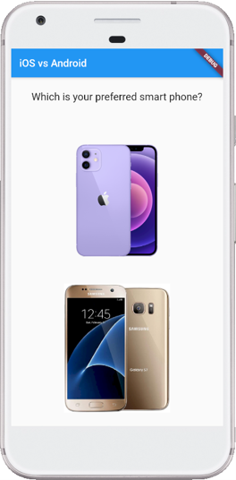
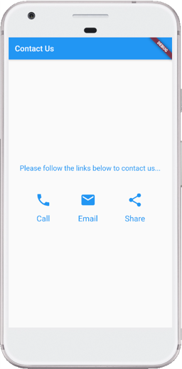
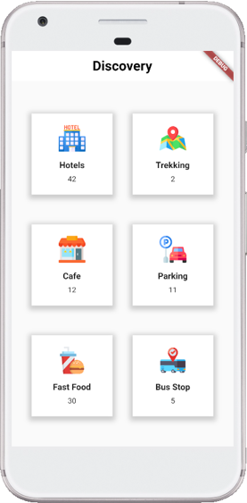

# Exercise 3 - Flutter User Interface Design
This exercise is expected you to get yourself familiarized with user Inteface Design in Flutter These exercises assume you already have setup your environment for working with Flutter.

## Instructions
* You are required to setup the environment that you are planning to use this term for this course
* You need Flutter framework to be installed and configured on your local machine to work with these exercises

* This exercise is for your practice, no need to submit it for marking.

### Basic
Design a Basic Layout as shown in the figure. You are free to use as many nested widgets as required.  <br />   
<br />  
You are free to use any images you like, however, if you want to use the images shown in the screenshot, you can use them at the following links ([iPhone](https://store.storeimages.cdn-apple.com/4982/as-images.apple.com/is/iphone-12-purple-select-2021?wid=470&hei=556&fmt=png-alpha&.v=1617130317000
), [Samsung](https://m.media-amazon.com/images/I/61KvXevceyL._AC_SL1054_.jpg)). Please note that these images belong to their respective owners and if you want to use them for commercial use, you might need to take permissions from the owners of these images.  

### Intermediate
Design a Basic Layout as shown in the figure. You are free to use as many nested widgets as required. Use Icon widget to get the call, email and share icons. Try using SizedBox between the column widgets to control the spaces.<br />  
<br />  

Try and practice various combination of Row and Column widget to see how they behave. There are some interesting properties of both Row and Column that can really help in aligning the text, e.g., mainAxisAlignment and crossAxisAlignment.<br />  

### Challenging
Design a Basic Layout as shown in the figure. You are free to use as many nested widgets as required. Use Row and Column widgets only except Scaffold. Use BoxDecoration for a Container to create boxes. Try using SizedBox between the column widgets to control the spaces.<br />  
<br />  
Please note that data shown in the screenshot is dummy. For now you can just use the Text widget to add those numbers shown in the screenshot. As for the images, use any appropriate images. Dont forget to create a folder in the project directory and add it to `pubspec.yaml` file. More information on how to add images to a flutter project in [this](https://flutter.dev/docs/development/ui/assets-and-images) link. <br />  

P.S.: Use the following code in decoration property of Container to add a BoxDecoration with Shadow:  
```
BoxDecoration(
          color: Colors.white,
          boxShadow: [
            BoxShadow(
              color: Colors.grey.withOpacity(0.5),
              spreadRadius: 5,
              blurRadius: 7,
              offset: Offset(0, 3), 
            ),
          ],)
```
