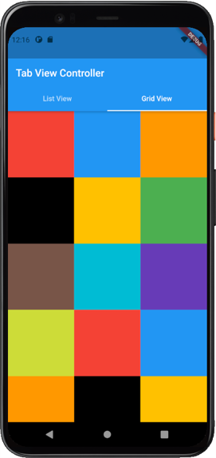
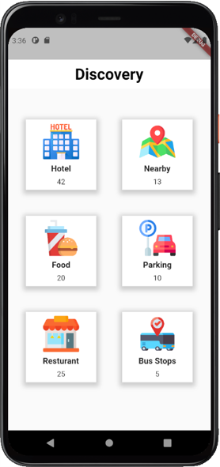

# Exercise 4 - Flutter User Interface Design
This exercise is expected you to get yourself familiarized with user Inteface Design in Flutter These exercises assume you already have setup your environment for working with Flutter.

## Instructions
* You are required to setup the environment that you are planning to use this term for this course
* You need Flutter framework to be installed and configured on your local machine to work with these exercises
* This exercise is for your practice, no need to submit it for marking.

### Basic
Design a Basic Layout as shown in the figure. You are free to use as many nested widgets as required. Nest a ListView and a GridView in a Tab Controller:
* Use DefaultTabController
* Use TabBar
* Use TabBarView      
   
You are free to use any ListView and GridView widgets that you have created. This exercise actually requires you to build a Tab View Controller that can incorporate these widgets into different tabs. 

### Intermediate
Design a Basic Layout as shown in the figure. Use GridView to design. You can use the following GridView properties to layout
* crossAxisSpacing
* mainAxisSpacing
* padding:  

Avoid copy pasting same code for multiple component. Write code so that it is reusable.

   

It is recommended that you use Rows and Columns to build a UI like this as GridView would complicate things, however, this exercise is just for your practice so that you can familiarize yourself with GridViews   

### Challenging
Design a Basic Layout as shown in the figure. You are free to use any widget. Try and optimize the code as much as possible. Look into `Expanded` Widget. `CircleAvatar` will give you circular pictures
   
   
Please note that data shown in the screenshot is dummy. For now you can just use the Text widget to add those numbers shown in the screenshot. As for the images, use any appropriate images. Dont forget to create a folder in the project directory and add it to `pubspec.yaml` file. More information on how to add images to a flutter project in [this](https://flutter.dev/docs/development/ui/assets-and-images) link.    