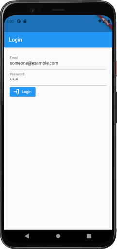
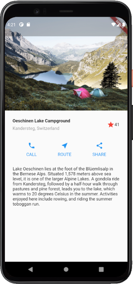
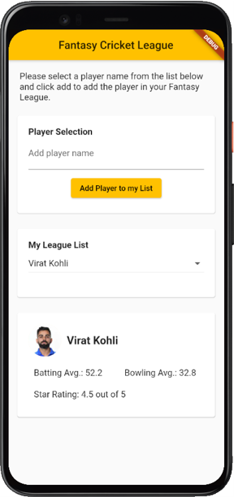

# Exercise 5 - Stateful Widgets and Forms
This exercise is expected you to get yourself familiarized with Stateful Widgets and Forms in Flutter. These exercises assume you already have setup your environment for working with Flutter.

## Instructions
* You are required to setup the environment that you are planning to use this term for this course
* You need Flutter framework to be installed and configured on your local machine to work with these exercises
* This exercise is for your practice, no need to submit it for marking.

### Basic
Create an app that uses a Form Widget with 3 fields:
* Email (TextFormField)
* Password (TextFormField)
* Login (ElevatedButton.icon)  

Validate both the TextFormFields by calling validator on form.
Save entered values of TextFormFields in corresponding instance variables.
Display a Snackbar if Login is successful e.g., fields are validated. You can find more information about Snackbar at [this link](https://flutter.dev/docs/cookbook/design/snackbars).  
<ins>Hint</ins>: For instance variables, you can create the instance variables inside the State class and set the values of the instance variables in `setState()` method just like what we did in the class for changing the color of the button. You might have already guessed it by now, Yes, you'll be using Stateful Widget for this exercise. Below is the expected output:  
   

### Intermediate
Create a design as shown in the screenshot. You are free to use any design strategy. Please note the following:
* Replace StatelessWidget for Favorite (highlighted in red in the screen) with a StatefulWidget such that:
  * If already favorite, on clicking the star icon, the counter should decrement by 1 (e.g. 40) and star icon should change to star icon with no fill
  * If not already favorite, on clicking the star icon, the counter should increment by 1 (e.g. 41) and star icon with no fill should change to star icon with fill
  * Instead of Star icon, you are free to use `Icons.favorite_border` and `Icons.favorite`. For more information on Icons, please visit [this link](https://api.flutter.dev/flutter/material/Icons-class.html).  
  
Try and optimize your code as much as possible and keep it clean by using different classes and files.

   

### Challenging
Create a Fantasy Cricket League design as shown in the screenshot below. Use Card widget to design the layout. Please note the following:
* First Card should have Form widget with `TextFormField` and `ElevatedButton`.  
* Second Card should have a DropdownButton widget along with a Text Widget that shows the title (My League List in the screenshot) of that card. 
* You are free to use any layout for Third Card. However, make sure to align the text, color and overall appearance to match the whole app.

<ins>Functionality</ins>: Make sure your app is able to perform the following actions:
* On the click of the `ElevatedButton`, the entered text in the `TextFormField` should be added to the `DropdownButton` and should be updated with the new name.
* On selecting the name of the player from DropdownButton in the second card, the third card should be updated with player details. Initially, the third card should display the details of the first player in the DropdownButton.

<ins>Disclaimer:</ins> Please make sure to use images that you have permissions to use. Please note the images used in the screenshot are not for commercial purposes and belong to their respective owners.

    
Please note that data shown in the screenshot is dummy. For now you can just use the Text widget to add those numbers shown in the screenshot. As for the images, use any appropriate images. Dont forget to create a folder in the project directory and add it to `pubspec.yaml` file. More information on how to add images to a flutter project in [this](https://flutter.dev/docs/development/ui/assets-and-images) link.    