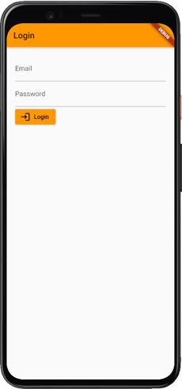
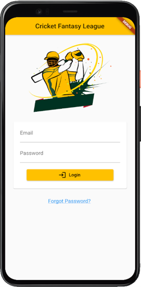
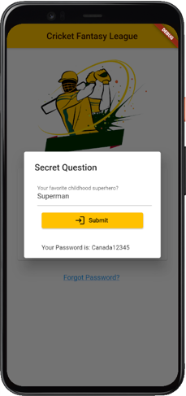
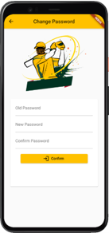

# Exercise 6 - Dialogs, Pickers and Navigations
This exercise is expected you to get yourself familiarized with Dialogs, Pickers and Navigations in Flutter. These exercises assume you already have setup your environment for working with Flutter.

## Instructions
* You are required to setup the environment that you are planning to use this term for this course
* You need Flutter framework to be installed and configured on your local machine to work with these exercises
* This exercise is for your practice, no need to submit it for marking.

### Basic
Use the Login Screen designed in previous exercises. Update the app design to move to new screen on a successful login using UnNamed Routes.  
The first screens shows the Login Screen that you have completed in the previous exercise. On the Login button of the screen, add code so that name of the user (you are free to hardcode the name for now) is sent from the first screen to the second screen when switching between screens occur. You are free to use any image on the second screen. Below is the expected output:       
 &nbsp; &nbsp; &nbsp;   

### Intermediate
Update the Login Screen designed in the previous exercises. Add a Forgot Password Text using [GestureDetector](https://api.flutter.dev/flutter/widgets/GestureDetector-class.html). OnTap of GestureDetector, display a SimpleDialog shown in the second screenshot. SimpleDialog has a TextFormField, an ElevatedButton and a Text. TextFormField is expected to take some text from the user, assuming that it is something like a secret word user has chosen at the time of registration. You can hardcode this secret word for now. If the secret word is equal to the one you hard coded, clicking on ElevatedButton would reveal the Password in the Text widget shown at the bottom of the dialog as shown in the second screenshot.  

 &nbsp; &nbsp; &nbsp;   

### Challenging
Update the Login Screen designed in the previous exercise. Once a successful login occurs, move to change password screen, shown in the second screenshot. One the Change Password screen, compare the password from the login screen with the password entered in Old Password TextFormField. Also, compare the New and the Confirm Passwords. If everything is OK, show a Dialog and on click of “OK” on dialog, screen should move to the Login Screen.

Make sure to validate the TextFormFields using Form widget this would help you in familiarizing yourself with using Form widget on multiple FormFields like TextFormField. Screenshots below show the flow of the screens.

 &nbsp; &nbsp; &nbsp;  &nbsp; &nbsp; &nbsp;     