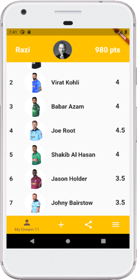
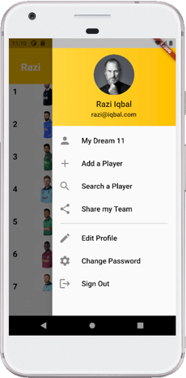
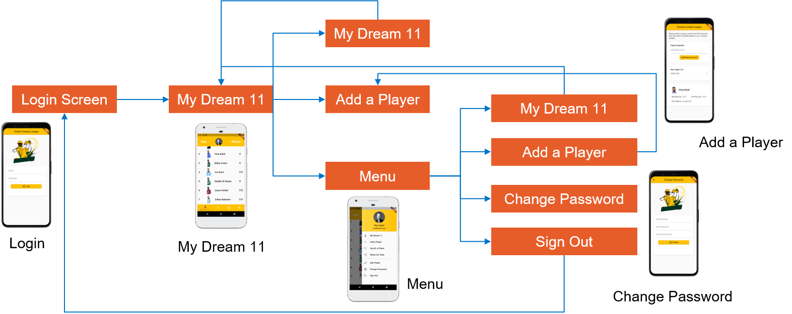

# Exercise 7 - Scaffold Components
This exercise is expected you to get yourself familiarized with Scaffold Components in Flutter. These exercises assume you already have setup your environment for working with Flutter.

## Instructions
* You are required to setup the environment that you are planning to use this term for this course
* You need Flutter framework to be installed and configured on your local machine to work with these exercises
* This exercise is for your practice, no need to submit it for marking.

### Basic
Update the Cricket Fantasy League app design to look similar to the one shown in the screenshot. Please note the following:
* AppBar has no title (extend AppBar class to modify)
* List of Players are scrollable (explore ListView)
* The app design has a BottomNavigationBar
  * BackgroundColor should match the AppBar
  * SelectedItem should have a different color than other items
  * Implement setState() to set currentIndex of BottomNavigationBar
  * Last Item is a Menu item

Make sure the ListView items are aligned properly, especially the images and the text next to them. You are free to use any images, just make sure you have enough permissions to use the images. Also, the data is dummy, so feel free to add any type of appropriate data for the app. Below is the expected output:       
 &nbsp; &nbsp; &nbsp;   

### Intermediate
Create a Drawer as shown in the second screenshot. Please make sure the followings: 
* Use ListView to add items to Drawer
* Look into [DrawerHeader](https://api.flutter.dev/flutter/material/DrawerHeader-class.html) for drawing the header of the drawer
* Use ListTile to add children to ListView for non-header items
* Use gradient in [BoxDecoration](https://api.flutter.dev/flutter/painting/BoxDecoration-class.html) to apply color gradient to header background
* Look into [Divider](https://api.flutter.dev/flutter/material/Divider-class.html) for adding a separator
  

 &nbsp; &nbsp; &nbsp;   

Please note the following:
* The Drawer should appear from the right side when menu item is clicked on BottomNavigationBar
* Explore [endDrawer](https://api.flutter.dev/flutter/material/Scaffold/endDrawer.html) to make drawer appear from right.

### Challenging
Integrate all the designed screens into one app designed in "Do it yourself". Please note the following:
* All major widgets should have separate dart files in your project
* Below should be the sequence of screens:

     