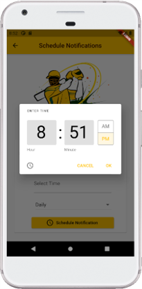

# Exercise 8 - Snackbar and Notifications
This exercise is expected you to get yourself familiarized with Snackbar and Notifications in Flutter. These exercises assume you already have setup your environment for working with Flutter.

## Instructions
* You are required to setup the environment that you are planning to use this term for this course
* You need Flutter framework to be installed and configured on your local machine to work with these exercises
* This exercise is for your practice, no need to submit it for marking.

### Basic
Add a Snackbar to the last week’s challenge yourself exercise as shown in the screenshot. Please note the following:
* On "Add a Player" screen, show a Snackbar when a player is successfully added to the list
* Snackbar should look similar to the one in the screenshot (note there is an icon as always but this time a different icon).
* Snackbar should be shown for a duration of 30 seconds
* If user clicks Dismiss on Snackbar, it should be immediately closed

Try and customize the Snackbar as shown in the screenshot to match the theme of your app. Your are free to use any theme you like. Below is the expected output:       
 &nbsp; &nbsp; &nbsp;   

### Intermediate and Challenging
Take the Cricket Fantasy App completed in the previous exercise. Add a Menu Item "Schedule Notification" to the drawer. Clicking Schedule Notification should open a new page as shown in the second screenshot that has following components:
* A TextField which when clicked opens a DatePicker to allow picking dates
* A TextField which when clicked opens a TimePicker to allow picking times
* A DropDownButton which has items, "Daily, Weekly and Monthly"
* An Elevated Icon Button "Schedule Notification" which would schedule notification on daily, weekly or monthly basis

 &nbsp; &nbsp; &nbsp; 
 
  

Look into `intl` package for Date Formatting. Add it to your yaml file before using it. Import the package and use it to format the dates to your convenience.

Below are some screenshots of TextFields when clicked to show DatePicker, TimePicker and DropDownButton:

 &nbsp; &nbsp; &nbsp;  &nbsp; &nbsp; &nbsp; 

